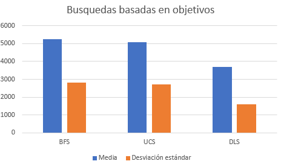

# ¿Qué algoritmo es más adecuado?

Podemos verlo según dos criteros: 

## Qué tan rapido encontramos la solución

Si nos basamos en esto, el más adecuado es la búsqueda limitada. Ya que, según los resultados obtenidos, podemos observar que es el que menos estados recorre. Sin embargo, como ya sabemos, este algoritmo no nos da certeza de que la solución hallada sea la mejor ya que una vez que encuentra la solución no se cuestiona la posibilidad de que hayan soluciones más óptimas.

## Encontrar la solución más óptima

Desde este punto de vista, creo que el más adecuado es Uniform Cost Search si tenemos que cada nodo tiene el mismo costo. Esto se debe a que la búsqueda por amplitud no tiene en cuenta el costo de cada camino, es decir: si le agregamos algún tipo de costo a cada nodo, UCS es mejor. Sin embargo, si se trata de un ambiente en el que no es necesario tener presente este costo, entonces BFS es la mejor opción.

## Representación gráfica de la media y desviación estándar de la cantidad de estados recorridos por cada algoritmo:

